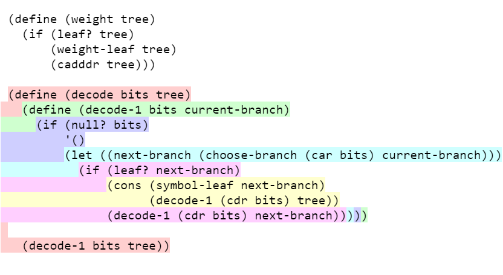

# Tinteme

Tinteme is an extension for Visual Studio Code that can **highlight s-expressions**. This extension can be useful when browsing other programmers' code.

## Usage

Run **Command Palette** (<kbd>Ctrl</kbd>+<kbd>Shift</kbd>+<kbd>P</kbd>) and search for **Tinteme: Highlight s-expressions**.

## Extension Settings

This extension contributes the following settings:

* `tinteme.foreground`: set foreground color (default: editor's foreground)
* `tinteme.background`: set background color (default: editor's background)
* `tinteme.colors.darkTheme`: set array of colors for dark themes
* `tinteme.colors.lightTheme`: set array of colors for light themes

## Release Notes

### 0.0.1

Initial release of Tinteme.